# Autonomous Orchard IoT Monitoring System

Smart irrigation system for a pilot orchard on campus, built as one of the first projects using the Intel IoT Laboratory at UPY. The system monitored soil moisture, ambient conditions, and water reservoir level, automatically activating irrigation when needed. The orchard produced a harvest of radishes, proving the system worked beyond a technical demonstration.

## Context
- **Date:** April 2018
- **Institution:** Universidad Politecnica de Yucatan (UPY)
- **Course/Event:** 1st Internship (Intel IoT Laboratory)
- **Type:** University Internship

## What It Does
An Intel Edison board serves as the central controller for an autonomous irrigation system in a small campus orchard. A solenoid valve controls water flow based on real-time sensor readings:

- **6 soil moisture sensors** (analog, A0-A5) monitor moisture levels across the orchard
- **TH02 sensor** (I2C) reads ambient temperature and humidity
- **HC-SR04 ultrasonic sensor** measures water reservoir level to track remaining supply

When soil moisture drops below 70%, the valve opens to irrigate. It closes when moisture reaches 77% or after a 10-minute safety timeout. All sensor data is logged to a remote database via WiFi through a PHP endpoint.

A PIC18F4550 version was also developed using a DHT11 sensor and timer-based interrupt sampling for concurrent data acquisition.

## Hardware Components

| Component | Purpose |
|-----------|---------|
| Intel Edison board | Central controller (programmed in Arduino Sketch) |
| Grove Indoor Environment Kit | Shield with sensor connectors for the Edison |
| 6x analog soil moisture sensors | Monitor moisture levels across orchard plots (A0-A5) |
| TH02 temperature/humidity sensor | Reads ambient temperature and humidity via I2C |
| HC-SR04 ultrasonic sensor | Measures water level in the reservoir (distance to surface) |
| Solenoid valve | Controls water flow to the irrigation lines |
| Relay module | Switches the solenoid valve on/off via GPIO |
| RGB LCD display (Grove) | Local readout of moisture, temperature, humidity |
| Water tank + PVC piping | Elevated reservoir with gravity-assisted flow to the plots |
| Drip irrigation lines | Distribute water across the orchard rows |
| WiFi module | Sends sensor data to remote PHP/MySQL server |

### PIC Version (alternative)

| Component | Purpose |
|-----------|---------|
| PIC18F4550 microcontroller | Central controller (CCS C compiler) |
| DHT11 sensor | Temperature and humidity (replaces TH02) |
| ESP8266 WiFi module | Network connectivity via AT commands over UART |
| LCD 16x2 display | Local readout (replaces Grove RGB LCD) |

## Tech Stack
- Arduino Sketch (Intel Edison / Arduino IDE)
- CCS C compiler (PIC version, ccsinfo.com)
- PHP + PhpMyAdmin + MySQL (server-side data logging)
- WiFi HTTP GET (sensor data transmission)

## How to Run
Requires specific hardware (Intel Edison or Arduino with WiFi, sensors, solenoid valve, relay). Upload the desired `.ino` sketch via Arduino IDE. Configure WiFi credentials and server IP in the sketch before uploading.

For the PIC version, compile `orchard.c` with the CCS C compiler and load the `.hex` file via a PIC programmer. Place `DHT11.c` in the same directory.

## Files

### Arduino Sketches (development progression)

| File | Description |
|------|-------------|
| `orchard.ino` | **Final version.** 6 moisture sensors + TH02 + ultrasonic (reservoir volume) + WiFi reporting + irrigation control (70-77% thresholds, 10min safety timeout) |
| `v4-wifi-6sensors.ino` | 6 sensors + TH02 + WiFi to `/second.php` + relay control |
| `v3-wifi-full.ino` | 6 sensors + TH02 + WiFi (first attempt at HTTP reporting, 60s interval) |
| `v2-wifi-4sensors.ino` | 4 sensors + TH02 + WiFi to `/second.php` + relay control |
| `v1-basic-moisture.ino` | 4 sensors + TH02 + RGB LCD display + relay control. No WiFi |
| `test-th02-wifi.ino` | TH02 WiFi connectivity test |
| `test-dht11.ino` | DHT11 sensor reading test |
| `sensors-tester.ino` | Reads and averages 6 moisture sensors. Calibration utility |

### PIC Version

| File | Description |
|------|-------------|
| `pic/orchard.c` | PIC18F4550 version using DHT11, 6 moisture sensors, ultrasonic distance, LCD display, and ESP8266 WiFi module. Timer-interrupt architecture (Timer3: moisture, Timer1: DHT11, Timer0: ultrasonic) with flag-based main loop for irrigation control and HTTP data reporting |

## Images

### Hardware Setup
| | |
|---|---|
| 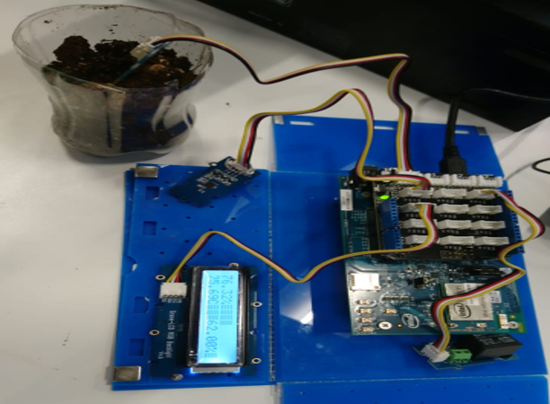 | 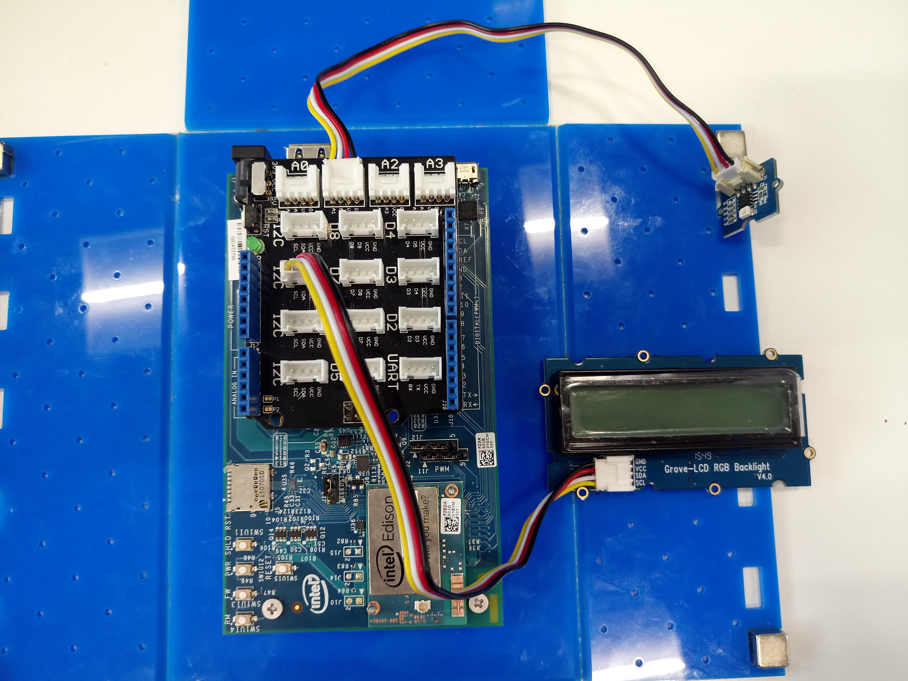 |
| Intel Edison board with Grove shield | Board top view showing sensor connections |

### Intel Edison Grove Kit in Lab
| | |
|---|---|
| 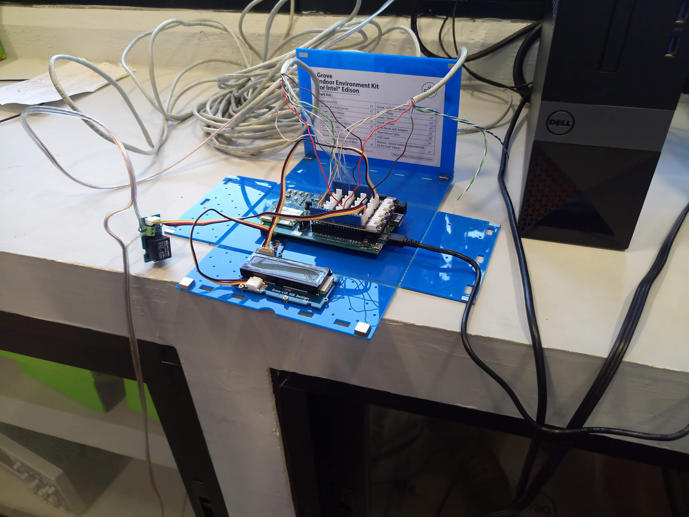 | 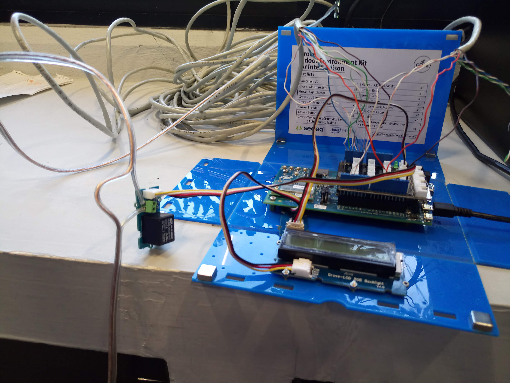 |
| Grove Indoor Environment Kit for Intel Edison | Sensor wiring detail (TH02, ultrasonic) |

### Irrigation System in the Field
| | |
|---|---|
| 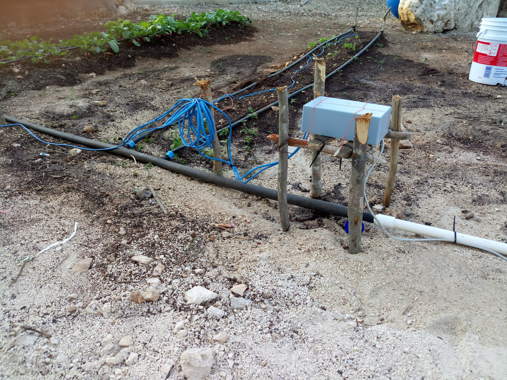 | 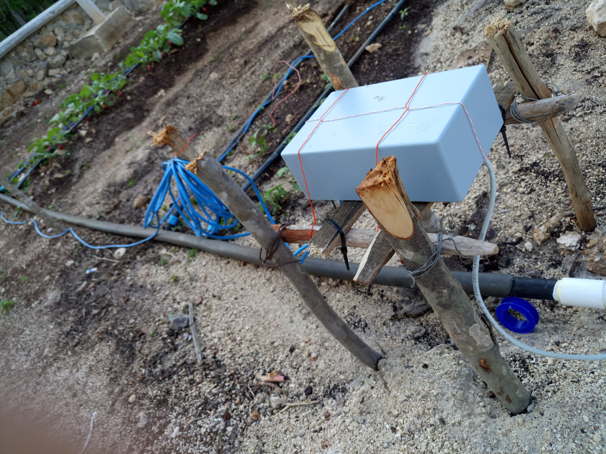 |
| Irrigation system installed in the orchard | Enclosure with sensor wiring |

### Water Tank
| | |
|---|---|
| 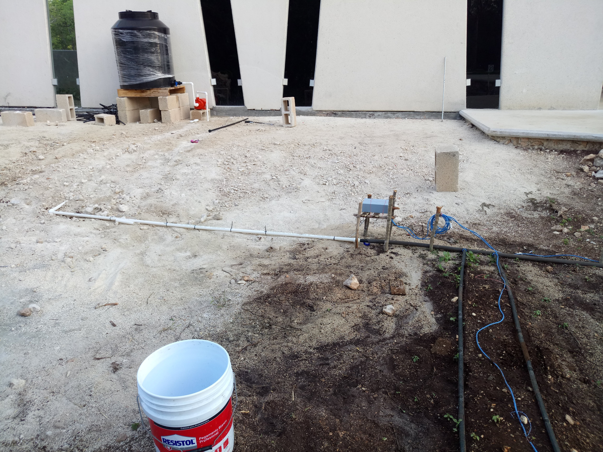 | 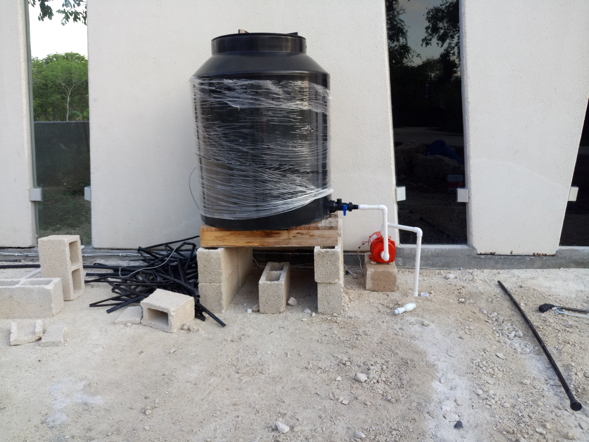 |
| Full site showing water reservoir | Water tank with solenoid valve and PVC piping |

### Orchard Growth and Harvest
| | |
|---|---|
| 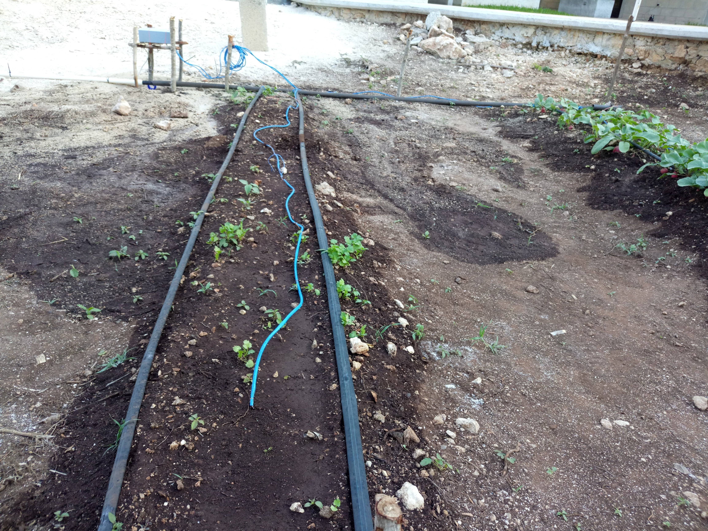 | 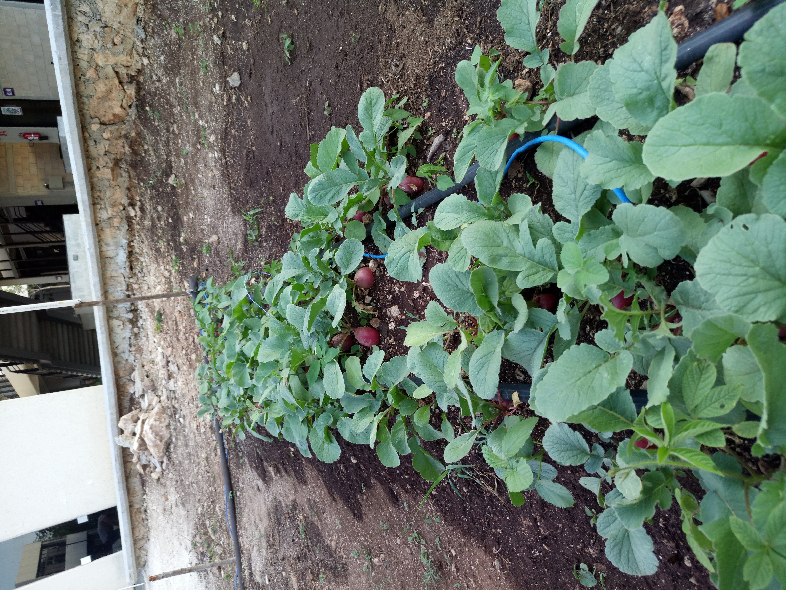 |
| Orchard rows with early plant growth | Radish harvest — proof the system worked |

### Full Site Overview
| | |
|---|---|
| 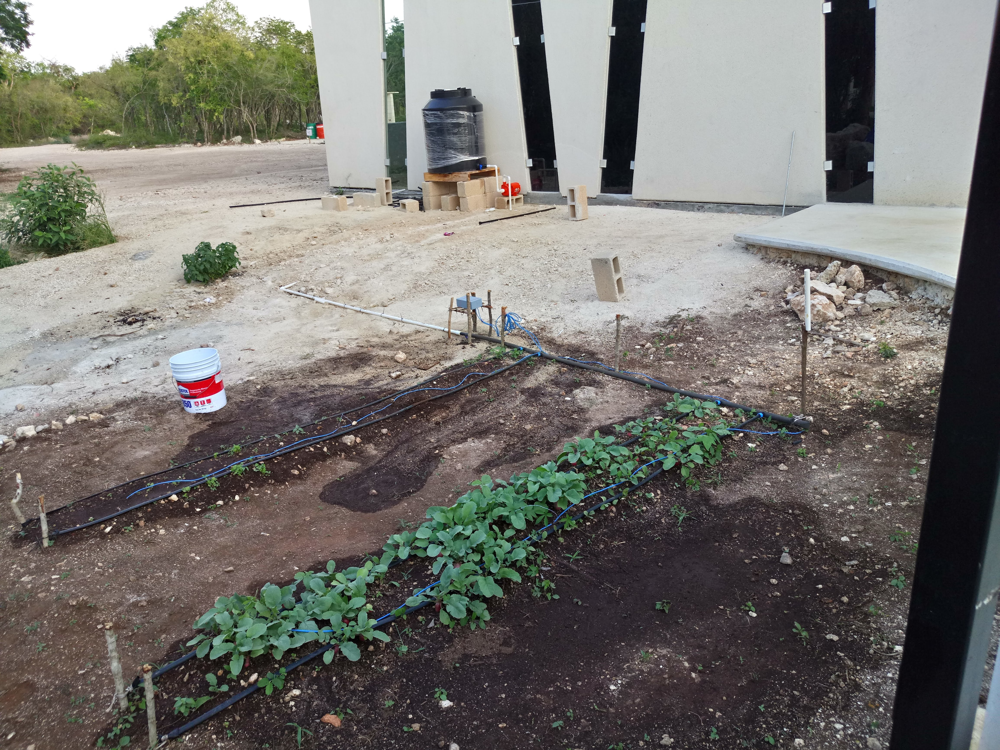 | 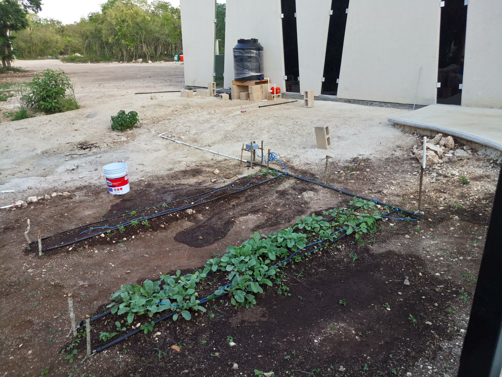 |
| Full site: orchard plots, controller, water tank | Alternative angle showing irrigation lines |

### Database & Team
| | |
|---|---|
| 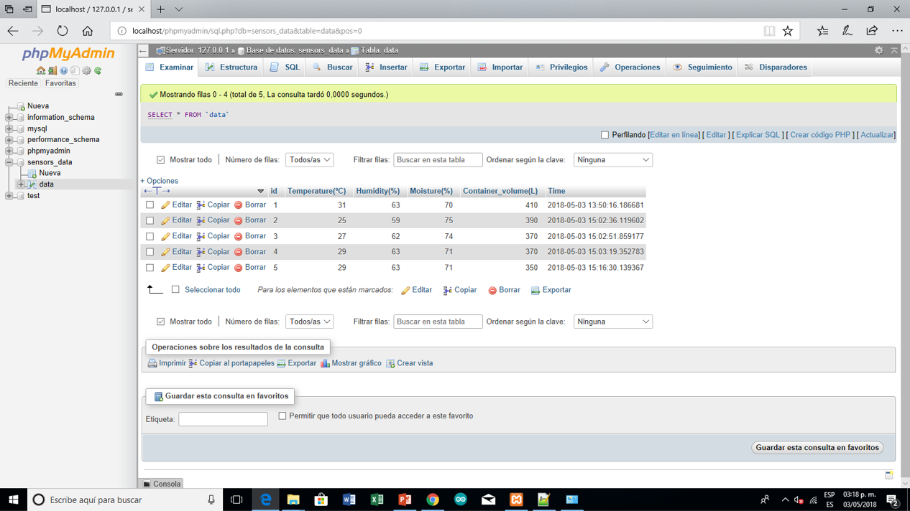 | 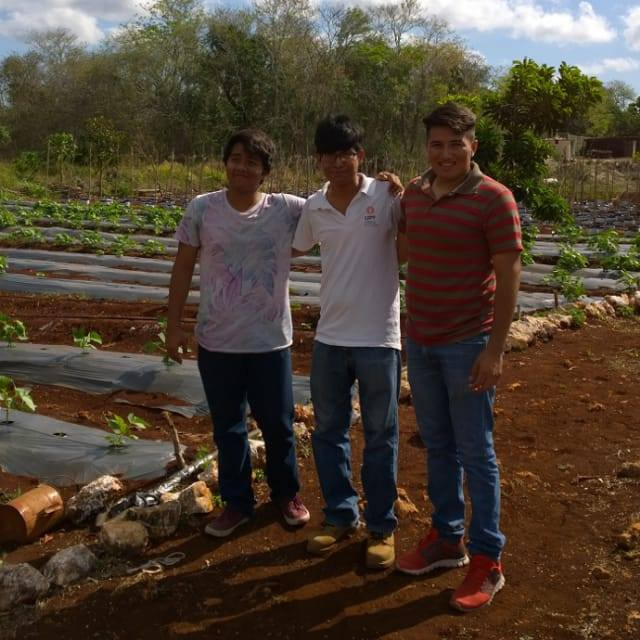 |
| Sensor readings logged in PhpMyAdmin | Team at the orchard site |
